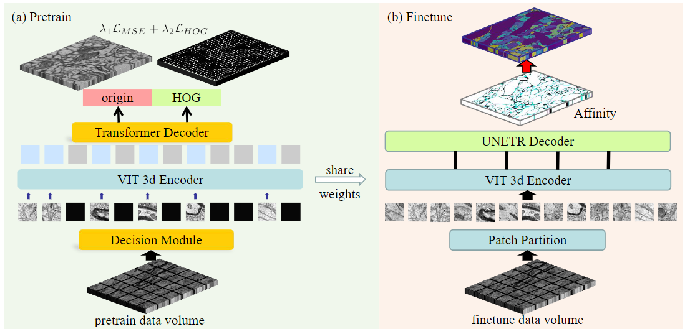
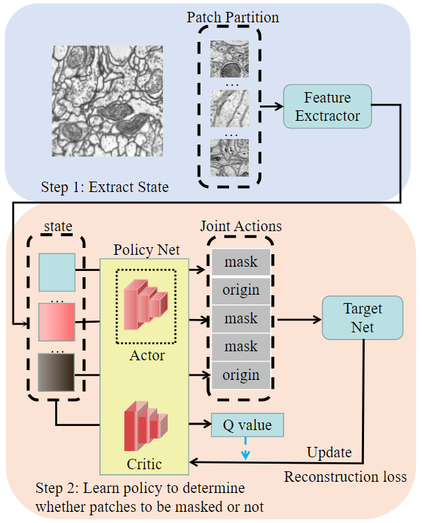

# Self-supervised Neuron Segmentation with Multi-agent Reinforcement Learning (IJCAI 2023)

This repository contains the official implementation of the paper **Self-supervised Neuron Segmentation with Multi-agent Reinforcement Learning**, presented at IJCAI 2023. You can find the paper [here](https://www.ijcai.org/proceedings/2023/0068.pdf).

<div style="text-align: center;">
  
  <p><b>Figure 1:</b> The pipeline of our proposed methods</p>
</div>

<div style="text-align: center;">
  
  <p><b>Figure 2:</b> The framework of our proposed decision module</p>
</div>

## Environment Setup

To streamline the setup process, we provide a Docker image that can be used to set up the environment with a single command. The Docker image is available at:

```sh
docker pull registry.cn-hangzhou.aliyuncs.com/cyd_dl/monai-vit:v26
```
## Dataset Download

The datasets required for pre-training and segmentation are as follows:

| Dataset Type          | Dataset Name           | Description                              | URL                                           |
|-----------------------|------------------------|------------------------------------------|-----------------------------------------------|
| Pre-training Dataset  | Region of FAFB Dataset | Fly brain dataset for pre-training       | [FAFB Dataset](https://link-to-fafb-dataset)  |
| Segmentation Dataset  | CREMI Dataset          | Challenge on circuit reconstruction datasets| [CREMI Dataset](https://cremi.org/)           |

### Pre-training Dataset: Region of FAFB

The Region of FAFB dataset is used for pre-training. Please follow the instructions provided in the paper to acquire and preprocess this dataset. You can download it from the URL above.

### Segmentation Dataset: CREMI

The CREMI dataset is used for the segmentation tasks. Detailed instructions for downloading and preprocessing can be found on the [CREMI Challenge website](https://cremi.org/).

## Usage Guide

### 1. Pretraining
```
python pretrain.py -c pretraining_all -m train
```
### 2. Finetuning
```
python finetune.py -c seg_3d -m train -w [your pretrained path]
```

## Citation

If you find this code useful in your research, please consider citing our paper:

```bibtex
@inproceedings{chen2023self,
  title={Self-supervised neuron segmentation with multi-agent reinforcement learning},
  author={Chen, Yinda and Huang, Wei and Zhou, Shenglong and Chen, Qi and Xiong, Zhiwei},
  booktitle={Proceedings of the Thirty-Second International Joint Conference on Artificial Intelligence},
  pages={609--617},
  year={2023}
}
```
# Contact 
If you need any help or are looking for cooperation feel free to contact us. cyd0806@mail.ustc.edu.cn
